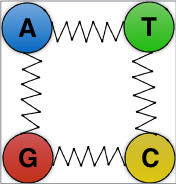

#Quark 

semi-reference-based short read compression

<p align="center">

</p>


##Assumption
The read files are in gzipped format i.e. they should be like .. 1.fastq.gz and 2.fastq.gz

The software is tested on paired end and single end data on bash compatible shell (redirection might not work with *fish* kind of ad on), ~~*single end support will be added to the "quark.sh" script soon*.~~


##Compile
```{r, engine='bash', encode and decode}
$git clone www.github.com/COMBINE-lab/quark.git
$cd quark
$mkdir build
$cd build
$cmake ..
$make
$cd ..
```

##Running Quark
To see the options

```{r, engine='bash', encode and decode}
$./mainscript.sh -h

```

###To build the index


```{r, engine='bash', encode and decode}
$./mainscript.sh index -t <transcript fasta> -o <out dir> -k <k mer length>

```

###To Encode
####Single End
```{r, engine='bash', encode and decode}
$./mainscript.sh -r <read file> -i <index> -p <threads> -o <out dir>

```
####Paired end

```{r, engine='bash', encode and decode}
$./mainscript.sh -1 <left_end> -2 <right_end> -i <index> -p <threads> -o <out dir>

```

###To Decode

```{r, engine='bash', encode and decode}
$./mainscript.sh -d decode -l [P/S] -i <input dir> -p <threads> -o <out dir>

```

##To check the encoded and decoded sequences are same !! (it is lossless) 


```{r, engine='bash', encode and decode}
$./check_pair.sh <original left end> <original right end> <quark left end> <quark right end>

```
##Link to the preprint

[Quark enables semi-reference-based compression of RNA-seq data](http://dx.doi.org/10.1101/085878) by Hirak Sarkar, Rob Patro

